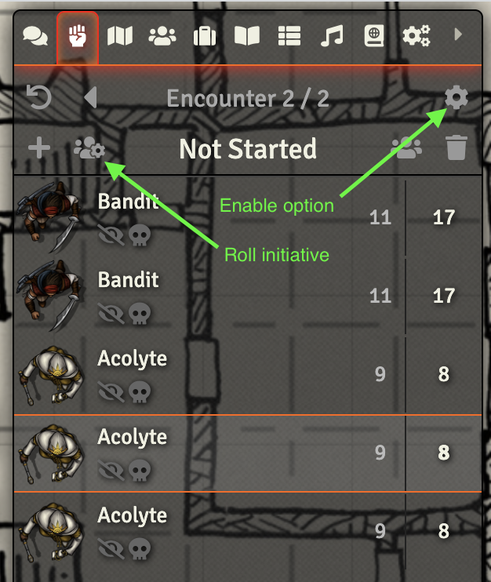

# Group Initiative

Roll Group Initiative from the Combat Tracker in [Foundry VTT](https://foundryvtt.com/)

## Install

1. Go to the "Add-on Modules" tab in Foundry Setup
2. Click "Install Module" and paste this link: `https://raw.githubusercontent.com/tonifisler/foundry-group-initiative/master/module.json`
3. Open your world and go to the "Combat Tracker" tab
4. Open the "Combat Tracker Settings" (cog at the top right of the Encounter pane) and check the "Roll Group Initative" option
5. Use the "Roll NPCs" button to automatically roll initiative by group

