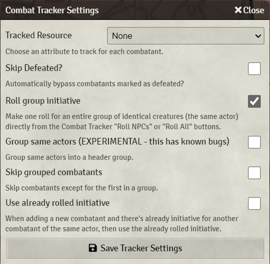
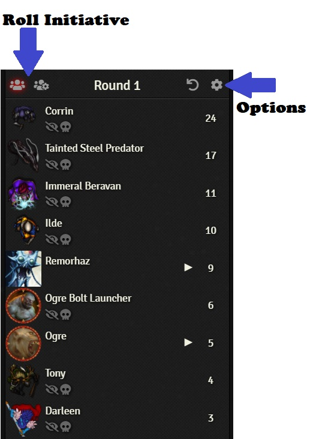
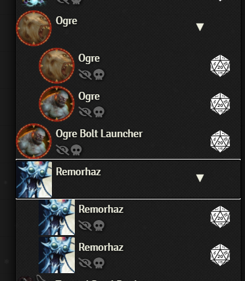
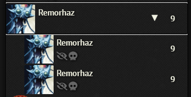

  

# Group Initiative
Roll Group Initiative from the Combat Tracker in [Foundry VTT](https://foundryvtt.com/)

# Options
## Roll group initiative
Make one roll for an entire group of identical creatures (the same actor) directly from the Combact Tracker's "Roll NPCs" or "Roll All" buttons

## Skip grouped combatants
Skip combatants in a group except for the first found in said group.

# Combat Tracker

## Install

1. Go to the "Add-on Modules" tab in Foundry Setup
2. Search for "Group Initiative"
3. Open your world and go to the "Combat Tracker" tab
4. Open the "Combat Tracker Settings" (cog at the top right of the Encounter pane) and check the "Roll Group Initative" option
5. Use one of the "Roll" buttons to automatically roll initiative for NPCs by group
